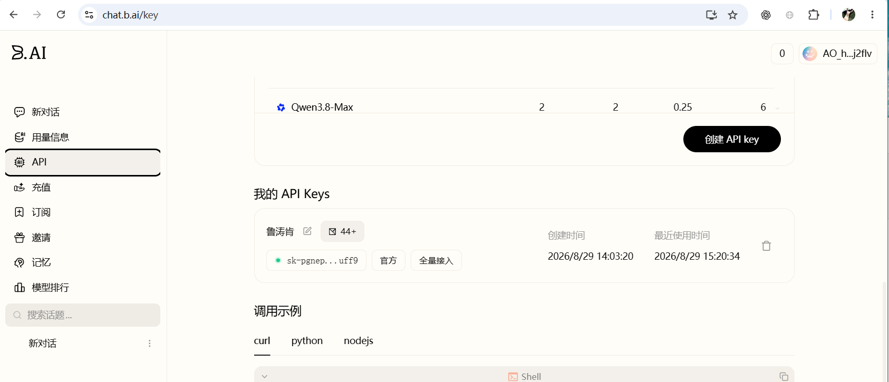
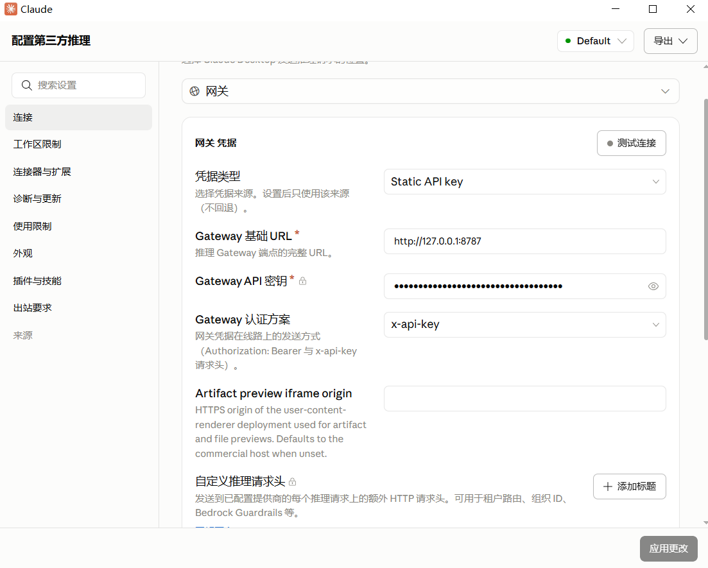
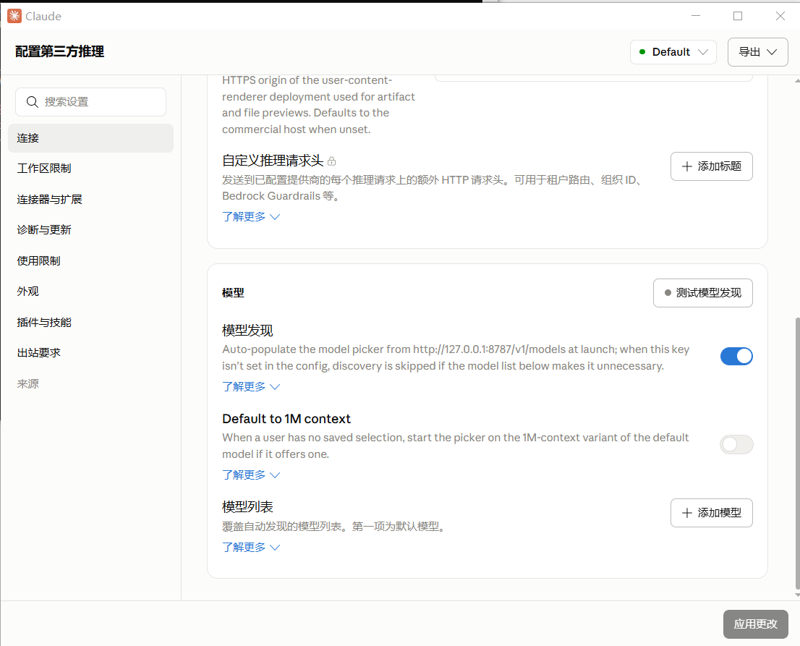

# Claude Code Desktop 使用 B.AI 免费模型（Windows）

这是一个 PHP / Workerman 本地代理。Claude Code Desktop 连接本机代理，代理再调用 B.AI。

## 准备

项目已内置 PHP 8.3.2 与 Workerman 依赖；只需要 Windows 和 Claude Code Desktop。Composer 仅在 `vendor` 被手动删除后才需要用于恢复依赖。

## 1. 创建 B.AI API Key

1. 打开 [https://chat.b.ai/chat](https://chat.b.ai/chat) 并登录。
2. 打开 [https://chat.b.ai/key](https://chat.b.ai/key)。
3. 点击“创建 API key”，选择“官方 / 全量接入”。
4. 复制新 Key。



## 2. 填写 Key

打开 `b.ai\.env`，填写：

```ini
BAI_API_KEY=你的 B.AI API Key
```

如果 `.env` 不存在，直接执行下一步；启动脚本会自动创建并打开它。

## 3. 启动代理

在资源管理器中直接双击：

[`b.ai\start-proxy.bat`](./b.ai/start-proxy.bat)

窗口显示下面内容即表示启动成功：

```text
Starting B.AI Claude Desktop local proxy at http://127.0.0.1:8787
```

保持这个窗口打开。关闭窗口或按 `Ctrl+C` 会停止代理。

## 4. 配置 Claude Code Desktop

打开“配置第三方推理”→“连接”，按下表填写：

| 字段 | 值 |
| --- | --- |
| Gateway 凭据类型 | `Static API key` |
| Gateway 基础 URL | `http://127.0.0.1:8787` |
| Gateway API 密钥 | 任意非空文本，例如 `local` |
| Gateway 认证方案 | `x-api-key` |
| Artifact preview iframe origin | 留空 |
| 自定义推理请求头 | 留空 |



继续下滑到“模型”区域：

1. 打开“模型发现”。
2. 测试点击“测试模型发现”。
3. 点击“应用更改”。



当前代理提供以下 B.AI 模型：

- `deepseek-v4-flash`
- `qwen3.8-flash`
- `hy3`

免费活动和模型可用性以 B.AI 页面为准。

## 出错时

- `found 0 models`：确认代理窗口仍开着，然后重启 Desktop 并重新测试模型发现。
- 推理超时：访问 <http://127.0.0.1:8787/health>；无法打开表示代理未启动。
- `403 access_denied`：到 [https://chat.b.ai/key](https://chat.b.ai/key) 检查 Key 权限或模型是否仍免费。

`.env` 含有 B.AI Key，不要上传、分享或截图。项目结构为：`b.ai/`（代理源码、配置与日志）、`php8.3.2nts/`（PHP 运行时）、`vendor/`（PHP 依赖）。
